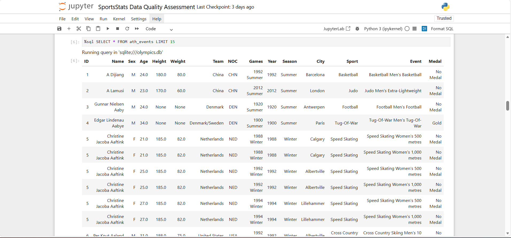
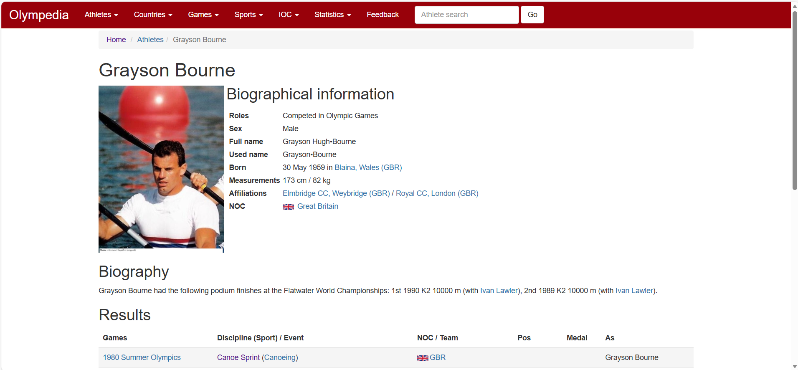
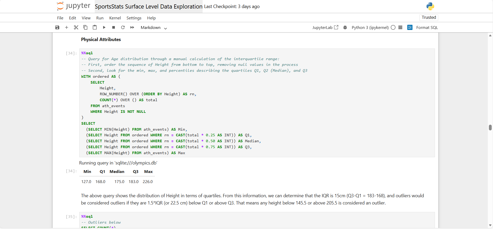

# 🏅 SportsStats Olympic Athlete Performance & Historical Trends — Data Quality, Cleaning, and Exploration

A Comprehensive SQL-Based Data Preparation Project Using 120 Years of Olympic History

---
## 📌 Overview

This project demonstrates end-to-end data preparation on **271,116 Olympic athlete records spanning 120 years** (1896-2016). Through systematic data quality assessment, research-backed cleaning, and SQL-driven transformations, I prepared messy historical data for advanced analytics—showcasing the real-world skills required for data analyst roles.

**Impact**: Removed 1,455 duplicates | Corrected 156 athlete records | Standardized 43 team names | Validated 15 columns across two decades of Olympic history

Built with: **Python** | **SQL (SQLite)** | **Pandas** | **Jupyter**
---
## 🚀 Quick Start

**Want a quick summary of all the work completed in this repository?**

→ See `SportsStats Executive Summary of Early Work.pdf`

**Just want to see the results?**

→ Open any `.html` file (no installation needed!)  
→ Start with `SportsStats Data Quality Assessment.html`

**Want the cleaned data?**

→ Download `SportsStats cleaned.zip`  
→ Unzip and load `athlete_events_cleaned.csv`

**Want to reproduce the analysis?**

1. Clone this repository
2. Extract `SportsStats.zip` 
3. Run notebooks in order: `01_DQA → 02_Cleaning → 03_Exploration`
4. See [Requirements](#requirements) for dependencies

---
## Preview

### Data Quality Assessment


*Validating 15 columns across 271K records—checking ranges, patterns, and integrity*

### Data Cleaning Transformations


*SQL-driven corrections: imputation for missing data (shown), removal of duplicates (not shown), etc.*

### Pattern Matching with Regex


*Identifying 43 dual-country team names using regex pattern matching—a key data quality issue*

### Cross-Referencing through Research


*External research with Olympedia.org to cross-reference for athlete and event information at granular-level*

### Statistical Exploration


*Demographic analysis: age distributions (shown), medal patterns (not shown), geographic representation (not shown), etc.*

### Entity-Relationship Diagram


*Two-table structure connected by NOC data with a Many-to-One relationship between ath_events and noc_regions*

---
## 💼 Skills Demonstrated

### Technical Skills

**SQL & Database Management**

✅ Complex joins & CTEs *(linking athlete records to region data)*  
✅ Window functions & aggregations *(medal counts by country/era)*  
✅ Pattern matching & text manipulation *(regex for team name validation)*  
✅ Database design & normalization *(ERD development, relationship mapping)*

**Python & Data Engineering**

✅ Pandas for data manipulation *(handling 271K+ records efficiently)*  
✅ Jupysql integration *(seamless SQL in Jupyter notebooks)*  
✅ Data validation frameworks *(systematic 15-column quality checks)*  
✅ Automated pipelines *(CSV → SQLite → cleaned CSV exports)*

### Professional Competencies

**Data Quality Management**

✅ Issue prioritization *(1,455 duplicates vs. historical nulls—what to fix first)*  
✅ Root cause analysis *(dual-country team names traced to early Olympic history)*  
✅ Systematic workflows *(assess → clean → validate → document)*  
✅ Limitation documentation *(transparent reporting of known gaps)*

**Business Communication**

✅ Executive summaries *(1-page non-technical overview for leadership)*  
✅ Technical documentation *(reproducible Jupyter notebooks with markdown)*  
✅ Visual modeling *(ERD for stakeholder understanding)*

🔜 Research citations *(cross-referenced with Olympedia.org and other sources)*  

---
## 📝 Deliverables Included

### ✔️ 1. Data Quality Assessment Notebook

Identifies structural issues in the raw dataset, including:

- Duplicates
- Invalid NOC codes
- Missing demographic attributes
- Inaccurate team labels
- Temporal inconsistencies
- Broken foreign key relationships

### ✔️ 2. Data Cleaning Procedure Notebook

Systematically resolves issues identified in the DQA through:

- SQL-based transformations
- External research-driven imputation
- Standardization of formats
- Validation queries
- Exporting a final clean dataset

### ✔️ 3. Surface Level Data Exploration Notebook

Provides insights into the cleaned data through:

- Athlete demographics
- Era-based Olympic participation
- Sport and event coverage
- Medal distributions
- Key geographic patterns

### ✔️ 4. Project Proposal (PDF)

Outlines the analytical plan for future milestones:

- Project description
- Target audiences
- Research questions
- Hypotheses
- Analytical approach

### ✔️ 5. Executive Summary (PDF)

A high-level, non-technical summary intended for organizational leadership.

---
## 🧭 Project Purpose

This milestone prepares messy Olympic data for rigorous analysis through a three-phase approach:

### Phase 1: Systematic Quality Assessment
Identify duplicates, invalid NOC codes, missing demographics, inaccurate team labels, temporal inconsistencies, and broken foreign key relationships across 271K records.

### Phase 2: Research-Backed Cleaning
- Remove duplicates and standardize NOC codes
- Correct team names using regex pattern matching
- Handle nulls strategically (impute where possible, document where not)
- Cross-reference historical anomalies with Olympedia.org and other sources

### Phase 3: Exploratory Summary
Generate demographic profiles, geographic distributions, sport/event coverage stats, and medal patterns to contextualize the cleaned data for future advanced analytics.

**Result**: A production-ready dataset enabling analysis of 120 years of Olympic history with transparent documentation of all cleaning decisions and known limitations.

---
## 🎯 Why This Project Matters

### For Hiring Teams
This project demonstrates the **underrated but critical** 80% of data work that never makes it into polished dashboards:

- **Data never arrives clean**: I show how to systematically assess quality
- **Context matters**: I research historical context (1906 interim Olympics) to validate data
- **Trade-offs are real**: I document what I fixed vs. what I left as known limitations
- **Communication is key**: I deliver both technical notebooks and executive summaries

### For Data Science
Clean data is the foundation of reliable models. This project creates a trustworthy dataset for future predictive analytics, including:

- Medal probability modeling
- Demographic trend forecasting
- Home-country advantage analysis
- Gender equity progression studies

**The difference between "interesting findings" and "actionable insights" starts here.**

---
## 📈 Key Findings

### Dataset Structure (Post-Cleaning)
- **ath_events_cleaned**: 269,661 athlete participation records
- **noc_regions_cleaned**: 230 National Olympic Committee mappings
- **Relationship**: Many-to-One (athletes → NOCs)
- **Time Span**: 51 Olympic Games across 120 years (1896-2016)

### Data Quality Improvements
- ✅ **1,455 duplicate records** removed
- ✅ **43 team names** corrected (dual-country labels fixed via regex)
- ✅ **1 NOC code** standardized (Singapore: SIN → SGP)
- ✅ **231,333 medal values** clarified (NULL → "No Medal")

### Demographic Insights
- **Median athlete age**: 24 years
- **Age range**: 10-97 years (art competitions explain upper outliers)
- **Height/weight data**: 77% completeness (missing pre-1920 data documented)
- **Gender representation**: Tracked across 120-year evolution

### Geographic & Sport Patterns
- **Top participating nations**: France, USA, Great Britain
- **Most event-dense sports**: Shooting & Athletics (83 events each)
- **Medal distribution**: ~15% medalists vs. 85% non-medalists (expected ratio)

*Full analysis available in Surface Level Exploration Notebook*

---
## 🗂️ Repository Structure
```
SportsStats-Analysis/
│
├── 📊 Data Files
│   ├── SportsStats.zip                          # Raw data (271K records)
│   └── SportsStats cleaned.zip                  # Cleaned data (269K records)
│
├── 📓 Analysis Notebooks
│   ├── SportsStats Data Quality Assessment.*    # DQA (3 formats: .ipynb, .html, .md)
│   ├── SportsStats Data Cleaning Procedure.*    # Cleaning (3 formats)
│   ├── SportsStats Surface Level Exploration.*  # Exploration (3 formats)
│   └── SportsStats Olympics Research Appendix.* # Coming soon
│
├── 📄 Documentation
│   ├── SportsStats Project Proposal.pdf         # Analytical plan & hypotheses
│   ├── SportsStats Executive Summary.pdf        # 1-page leadership overview
│   └── SportsStats_ERD.png                      # Entity-relationship diagram
│
├── 📸 Screenshots
│   ├── Screenshot_of_ath_events_query.png
│   ├── Screenshot_of_data_updates.png
│   ├── Screenshot_of_regex_queries.png
│   ├── Screenshot_of_Olympedia_Research.png
│   └── Screenshot_of_statistical_summary_exploration.png
│
├── README.md                                    # You are here
└── LICENSE
```

**File Formats:**
- `.ipynb` = Jupyter notebooks (editable)
- `.html` = Standalone web view (no installation needed)
- `.md` = Markdown (GitHub-rendered)

---
## 📦 Requirements/Dependencies

**Software:**
- Python 3.8+
- Jupyter Notebook / JupyterLab

**Python Libraries:**
```python
pandas>=1.3.0
sqlite3 (built-in)
jupysql>=0.7.0
```

**Installation:**
```bash
pip install pandas jupysql
```

**Data:**
All required data files are included in `SportsStats.zip` and `SportsStats cleaned.zip`

---
## 💾 Note on Database Files

The `.db` files are not included in this repository to reduce file size. 
The database is regenerated automatically when you run the notebooks from 
the raw CSV data in `SportsStats.zip`.

**To create the database manually:**
```python
import pandas as pd
import sqlite3

conn = sqlite3.connect('olympics.db')
ath_events = pd.read_csv('athlete_events.csv')
noc_regions = pd.read_csv('noc_regions.csv')
ath_events.to_sql('ath_events', conn, if_exists='replace', index=False)
noc_regions.to_sql('noc_regions', conn, if_exists='replace', index=False)
```

---
## 🚀 Future Milestones

- Advanced analytics & statistical modeling
- Trend forecasting
- Nation-level performance analysis
- Gender progression studies
- Medal prediction models
- Visualization dashboards (Power BI / Tableau)

---
## 📬 Contact

Randy Gonzalez

Data Analyst | Applied Mathematics (UCLA)

📧 Email: randygonzalez249@gmail.com

🔗 LinkedIn: https://www.linkedin.com/in/randy-gonzalez-06b395261
