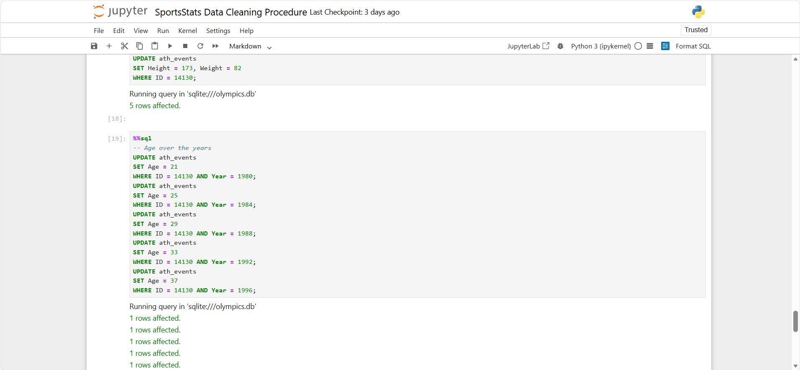

# 🏅 SportsStats Olympic Athlete Performance & Historical Trends — Data Quality, Cleaning, and Exploration

A Comprehensive SQL-Based Data Preparation Project Using 120 Years of Olympic History

---
## 📌 Overview

This repository contains the full set of deliverables from Milestone 1 of a multi-stage data analytics project analyzing 120 years of Olympic athlete performance data.
The project demonstrates end-to-end capabilities in:

- Data import and validation
- Data quality assessment
- Data cleaning & enrichment
- Research documentation & cross-referencing
- SQL-based data exploration
- ERD development
- Executive-level communication

The work is conducted in SQLite (via Jupyter + Jupysql) and is designed to showcase professional readiness for data analytics roles requiring SQL, data preparation, exploratory analysis, and structured reporting.

---
## 🚀 Quick Start

**Want to explore the analysis?**
1. 📊 **View the cleaned data**: Download `SportsStats cleaned.zip`
2. 📓 **Read the notebooks**: Start with `SportsStats Data Quality Assessment.html` (no setup required!)
3. 📄 **Executive overview**: See `SportsStats Executive Summary.pdf` for a 1-page summary

**Want to reproduce the work?**
1. Clone this repository
2. Extract `SportsStats.zip` to get the raw data
3. Run the notebooks in order: DQA → Cleaning → Exploration
4. All dependencies listed in [Requirements section below]

---
## Preview





---
## 💼 Skills Demonstrated

### Technical Skills

**SQL & Database:**
✅ Complex joins & CTEs  
✅ Window functions & aggregations  
✅ Pattern matching & text manipulation  
✅ Database design & normalization

**Python & Data Science:**
✅ Pandas for data manipulation  
✅ Jupyter for reproducible analysis  
✅ Data validation & quality checks  
✅ Statistical summarization

### Professional Skills

**Data Quality:**
✅ Issue identification & prioritization  
✅ Root cause analysis  
✅ Systematic cleaning workflows  
✅ Documentation of limitations

**Communication:**
✅ Technical documentation (notebooks)  
✅ Executive summaries (1-page PDFs)  
✅ Visual data modeling (ERDs)  
🔜 Research logging (appendix)

---
## 📝 Deliverables Included

### ✔️ 1. Data Quality Assessment Notebook

Identifies structural issues in the raw dataset, including:

- Duplicates
- Invalid NOC codes
- Missing demographic attributes
- Inaccurate team labels
- Temporal inconsistencies
- Broken foreign key relationships

### ✔️ 2. Data Cleaning Procedure Notebook

Systematically resolves issues identified in the DQA through:

- SQL-based transformations
- External research-driven imputation
- Standardization of formats
- Validation queries
- Exporting a final clean dataset

### ✔️ 3. Surface Level Data Exploration Notebook

Provides insights into the cleaned data through:

- Athlete demographics
- Era-based Olympic participation
- Sport and event coverage
- Medal distributions
- Key geographic patterns

### ✔️ 4. Project Proposal (PDF)

Outlines the analytical plan for future milestones:

- Project description
- Target audiences
- Research questions
- Hypotheses
- Analytical approach

### ✔️ 5. Executive Summary (PDF)

A high-level, non-technical summary intended for organizational leadership.

---
## 🧭 Project Purpose

The aim of this milestone is to prepare the Olympic athlete dataset for analysis by:

### 1. Assessing data quality:

Detecting missing values, invalid patterns, inconsistent country codes, duplicate records, and structural issues.

### 2. Cleaning and standardizing data:

- Removing duplicates
- Resolving NOC inconsistencies
- Handling missing values using external sources (Olympedia)
- Correcting historically inaccurate team labels
- Standardizing formats and text fields
- Adding meaningful imputed values where appropriate

### 3. Exploring high-level trends:

Producing summary statistics on athletes, events, sports, regions, eras, and medals.

---
## 📈 Key Findings (Preview)

The project uses a refined two-table structure: athlete_events_cleaned, noc_regions_cleaned
- athlete_events_cleaned: Contains cleaned athlete-level and event-level data (269,661 records)
- noc_regions_cleaned: Contains standardized country/NOC-to-region mappings (230 records)
- Datasets span 51 Olympic Games across 120 years
- Median athlete age: 24 years
- Height and weight distributions align with modern athlete expectations
- France, USA, and UK appear most frequently in historical team associations
- Shooting and Athletics have the most distinct events (83 each)
- “No Medal” accounts for ~85% of entries (expected given participant-to-podium ratio)

See the Surface Level Exploration Notebook for full context.

---
## 📂 Repository Structure

**Data**
- SportsStats.zip
    - athlete_events.csv
    - noc_regions.csv
- SportsStats cleaned.zip
    - athlete_events_cleaned.csv
    - noc_regions_cleaned.csv
    - sports_odc.csv

**Notebooks:**
- SportsStats Data Quality Assessment.ipynb
- SportsStats Data Cleaning Procedure.ipynb
- SportsStats Surface Level Exploration.ipynb
- SportsStats Olympics Research Appendix.ipynb (coming soon)

**HTML Files:**
- SportsStats Data Quality Assessment.html
- SportsStats Data Cleaning Procedure.html
- SportsStats Surface Level Exploration.html

**Markdown Files:**
- SportsStats Data Quality Assessment.md
- SportsStats Data Cleaning Procedure.md
- SportsStats Surface Level Exploration.md

**Documents:**
- SportsStats Project Proposal.pdf
- SportsStats Executive Summary of Early Work.pdf 
- SportsStats ERD.png
- README.md
- LICENSE

---
## 📦 Requirements/Dependencies

**Software:**
- Python 3.8+
- Jupyter Notebook / JupyterLab

**Python Libraries:**
```python
pandas>=1.3.0
sqlite3 (built-in)
jupysql>=0.7.0
```

**Installation:**
```bash
pip install pandas jupysql
```

**Data:**
All required data files are included in `SportsStats.zip` and `SportsStats cleaned.zip`

---
## 💾 Note on Database Files

The `.db` files are not included in this repository to reduce file size. 
The database is regenerated automatically when you run the notebooks from 
the raw CSV data in `SportsStats.zip`.

**To create the database manually:**
```python
import pandas as pd
import sqlite3

conn = sqlite3.connect('olympics.db')
ath_events = pd.read_csv('athlete_events.csv')
noc_regions = pd.read_csv('noc_regions.csv')
ath_events.to_sql('ath_events', conn, if_exists='replace', index=False)
noc_regions.to_sql('noc_regions', conn, if_exists='replace', index=False)
```

---
## 🚀 Future Milestones

- Advanced analytics & statistical modeling
- Trend forecasting
- Nation-level performance analysis
- Gender progression studies
- Medal prediction models
- Visualization dashboards (Power BI / Tableau)

---
## 📬 Contact

Randy Gonzalez

Data Analyst | Applied Mathematics (UCLA)

📧 Email: randygonzalez249@gmail.com

🔗 LinkedIn: https://www.linkedin.com/in/randy-gonzalez-06b395261
