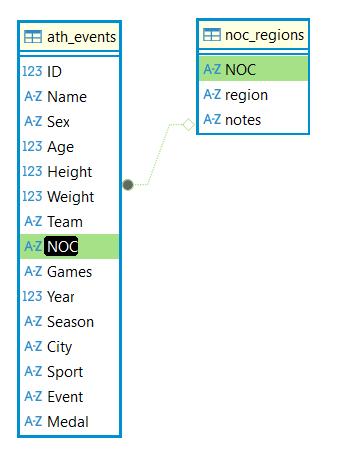

# SportsStats Surfece Level Data Exploration

**Table of Contents**

1. Introduction
2. Load Cleaned Data
3. Data Exploration
4. Summary of Statistics
5. Entity Relationship Diagram

---

## I. Introduction

The client I will be working with is SportsStats, a sports analysis firm partnering with local news and elite personal trainers to provide insights to help their partners. They recognize patterns/trends highlighting certain groups, events, countries, etc. for the purpose of developing a news story or discovering key health insights. As someone with a personal history with several sports such as basketball, martial arts, fencing, bicycling, and more, being able to perform analysis to gain insights on sports is something that personally engages me. Additionally, I reside within a culture that is heavily influenced by health and well-being as an ideal to pursue, so I find that this analysis that will be able to provide key health insights will provide value not only to the client I will be working with in this project, but also to the general public as well.

The Data Quality Assessment notebook provides the methodology and results for discovering issues with the raw data provided by SportsStats, and the Data Cleaning Procedure notebook provides the methodology for resolving most of the issues as well as access to cleaned versions of the datasets. The cleaned version of the dataset is precisely what I will be using for Surface Level Data Exploration to provide context for the dataset we will be working with in future analysis.

---
    
## II. Load Cleaned Data

First, you may desire to understand, and potentially adjust your working directory. Understanding from which environment you are working from is critical for your project, especially if you intend to replicate the steps provided. The code that will be provided after this step assumes you are working with a relative path to retrieve, load, and use CSV and DB files stored under the same folder as where this notebook would be saved. As such, make sure that your current working directory matches accordingly.

### Working Directory (Optional)


```python
# Import the os library
import os
```


```python
# Then use the following code to find out where your current working directory is
print(os.getcwd())
```

    C:\Users\randy\OneDrive\Documents\Data Analytics\SportsStats Analysis
    


```python
# If the cwd location for your project is not where you would prefer it to be, 
# use something akin to the following to change it:
os.chdir(r"C:\Users\randy\OneDrive\Documents\Data Analytics\SportsStats Analysis")
print(os.getcwd())
```

    C:\Users\randy\OneDrive\Documents\Data Analytics\SportsStats Analysis
    

### Importing Libraries

Before working on importing the data, import the libraries to use for the project. 
- Pandas will be used to import the data from the CSV files provided. 
- SQLite3 will be used to import Jupyter compatible extensions that will enable you to code and query in SQLite.
- re will be used to create a function into SQLite that will enable the usage of Regular Expressions (or Regex).


```python
# Importing the libraries
import pandas as pd
import sqlite3
import re
```

### Importing the data into Jupyter Notebook

Make sure the CSV files `athlete_events.csv` and `noc_regions.csv` are stored within your current working directory first before proceeding.


```python
# Reading the CSV Files as Dataframes
ath_events = pd.read_csv("athlete_events_cleaned.csv")
noc_regions = pd.read_csv("noc_regions_cleaned.csv")
```


```python
# Testing the success of reading:
print(ath_events.head(3))
print(noc_regions.head(3))
```

       ID                 Name Sex   Age  Height  Weight     Team  NOC  \
    0   1            A Dijiang   M  24.0   180.0    80.0    China  CHN   
    1   2             A Lamusi   M  23.0   170.0    60.0    China  CHN   
    2   3  Gunnar Nielsen Aaby   M  24.0     NaN     NaN  Denmark  DEN   
    
             Games  Year  Season       City       Sport  \
    0  1992 Summer  1992  Summer  Barcelona  Basketball   
    1  2012 Summer  2012  Summer     London        Judo   
    2  1920 Summer  1920  Summer  Antwerpen    Football   
    
                              Event     Medal  
    0   Basketball Men's Basketball  No Medal  
    1  Judo Men's Extra-Lightweight  No Medal  
    2       Football Men's Football  No Medal  
       NOC       region                 notes
    0  AFG  Afghanistan                   NaN
    1  AHO      Curacao  Netherlands Antilles
    2  ALB      Albania                   NaN
    

### Importing the data from Jupyter into SQL Database

We are going to create a connection between the data we have read thus far and a SQLite database. This code can either create a database file if one does not exist under the name you chose or connect the database file that exists with the same name.


```python
## Loading of Data into SQLite
conn = sqlite3.connect('olympics.db')
ath_events.to_sql('ath_events', conn, if_exists='replace', index=False)
noc_regions.to_sql('noc_regions', conn, if_exists='replace', index=False)

# The result of this would be a number. This number corresponds to the number of rows
# existing within the most recent dataset you connected to with your sqlite database.
# We previously set up a database for sqlite called "olympics.db". From there, we
# connected that database to the data we have listed over here.
```


    230


### Loading SQL Extensions and Regex to run SQL Queries

We will be using SQLite code to handle the data from here on out, but first, we need to install jupysql into the notebook itself if not installed yet. From there, we load the SQL extension into your notebook, connect to the olympics.db, configure so that the display limit is turned off, and establish the REGEXP function that will allow for the use of Regex during assessment.


```python
# Install jupysql (Only run code once. If already installed, no need to install again)
#!pip install jupysql
```


```python
# Load the SQL extension
%load_ext sql
```


```python
# Connect to olympics.db database
%sql sqlite:///olympics.db
```


<span style="None">Connecting to &#x27;sqlite:///olympics.db&#x27;</span>


```python
# If not yet configured so that the display limit no longer is active, this code turns it off:
%config SqlMagic.displaylimit = None
```


<span style="None">displaylimit: Value None will be treated as 0 (no limit)</span>


```python
# Define the REGEXP function
def regexp(pattern, value):
    if value is None:
        return False
    return re.search(pattern, value) is not None

# Register the function with SQLite
conn.create_function("REGEXP", 2, regexp)
```

*A note before proceeding with the surface level exploration, most of the code below will provide outputs for the first three rows simply for presentation purposes. To properly understand the data and its quality, you may need to alter the code to provide more rows.*

---

## III. Data Exploration

We will separate this portion into six sections:

1. Dataset Overview
2. Temporal Distribution                                                                                                                                3. Athlete Demographics                                                                                    
4. Geographic Representation                                                                                                                            5. Sports and Events                                                                                        
6. Medal Distribution

### i. Dataset Overview                                                                                                                                 
                                                                                                                                                        
To gain an overview of the datasets, we will be observing the table schemas, an overlook of the primary dataset `ath_events` and an overlook of the reference datase `noc_regions`.                                                                                                                                                                                                                    
**Table Schemas:**                                                                                                                                      


```sql
%%sql
-- Info on all the column names and data types of ath_events
PRAGMA table_info(ath_events)
```


<span style="None">Running query in &#x27;sqlite:///olympics.db&#x27;</span>


<table>
    <thead>
        <tr>
            <th>cid</th>
            <th>name</th>
            <th>type</th>
            <th>notnull</th>
            <th>dflt_value</th>
            <th>pk</th>
        </tr>
    </thead>
    <tbody>
        <tr>
            <td>0</td>
            <td>ID</td>
            <td>INTEGER</td>
            <td>0</td>
            <td>None</td>
            <td>0</td>
        </tr>
        <tr>
            <td>1</td>
            <td>Name</td>
            <td>TEXT</td>
            <td>0</td>
            <td>None</td>
            <td>0</td>
        </tr>
        <tr>
            <td>2</td>
            <td>Sex</td>
            <td>TEXT</td>
            <td>0</td>
            <td>None</td>
            <td>0</td>
        </tr>
        <tr>
            <td>3</td>
            <td>Age</td>
            <td>REAL</td>
            <td>0</td>
            <td>None</td>
            <td>0</td>
        </tr>
        <tr>
            <td>4</td>
            <td>Height</td>
            <td>REAL</td>
            <td>0</td>
            <td>None</td>
            <td>0</td>
        </tr>
        <tr>
            <td>5</td>
            <td>Weight</td>
            <td>REAL</td>
            <td>0</td>
            <td>None</td>
            <td>0</td>
        </tr>
        <tr>
            <td>6</td>
            <td>Team</td>
            <td>TEXT</td>
            <td>0</td>
            <td>None</td>
            <td>0</td>
        </tr>
        <tr>
            <td>7</td>
            <td>NOC</td>
            <td>TEXT</td>
            <td>0</td>
            <td>None</td>
            <td>0</td>
        </tr>
        <tr>
            <td>8</td>
            <td>Games</td>
            <td>TEXT</td>
            <td>0</td>
            <td>None</td>
            <td>0</td>
        </tr>
        <tr>
            <td>9</td>
            <td>Year</td>
            <td>INTEGER</td>
            <td>0</td>
            <td>None</td>
            <td>0</td>
        </tr>
        <tr>
            <td>10</td>
            <td>Season</td>
            <td>TEXT</td>
            <td>0</td>
            <td>None</td>
            <td>0</td>
        </tr>
        <tr>
            <td>11</td>
            <td>City</td>
            <td>TEXT</td>
            <td>0</td>
            <td>None</td>
            <td>0</td>
        </tr>
        <tr>
            <td>12</td>
            <td>Sport</td>
            <td>TEXT</td>
            <td>0</td>
            <td>None</td>
            <td>0</td>
        </tr>
        <tr>
            <td>13</td>
            <td>Event</td>
            <td>TEXT</td>
            <td>0</td>
            <td>None</td>
            <td>0</td>
        </tr>
        <tr>
            <td>14</td>
            <td>Medal</td>
            <td>TEXT</td>
            <td>0</td>
            <td>None</td>
            <td>0</td>
        </tr>
    </tbody>
</table>


```sql
%%sql
-- Info on all the column names and data types of noc_regions
PRAGMA table_info(noc_regions)
```


<span style="None">Running query in &#x27;sqlite:///olympics.db&#x27;</span>


<table>
    <thead>
        <tr>
            <th>cid</th>
            <th>name</th>
            <th>type</th>
            <th>notnull</th>
            <th>dflt_value</th>
            <th>pk</th>
        </tr>
    </thead>
    <tbody>
        <tr>
            <td>0</td>
            <td>NOC</td>
            <td>TEXT</td>
            <td>0</td>
            <td>None</td>
            <td>0</td>
        </tr>
        <tr>
            <td>1</td>
            <td>region</td>
            <td>TEXT</td>
            <td>0</td>
            <td>None</td>
            <td>0</td>
        </tr>
        <tr>
            <td>2</td>
            <td>notes</td>
            <td>TEXT</td>
            <td>0</td>
            <td>None</td>
            <td>0</td>
        </tr>
    </tbody>
</table>


The queries above shows the information about the tables that you will need to know. Note that the only INTEGER data types are for ID and Year, and the only REAL data types (which allows for decimal calculation) are for Age, Height, and Weight, but you will see that the values of those columns are expressed with whole numbers. The rest of the columns contain TEXT data.
                                                                                                                                                        **Primary Dataset**                                                               


```sql
%%sql
-- Number of records of ath_events
SELECT COUNT(*) FROM ath_events
```


<span style="None">Running query in &#x27;sqlite:///olympics.db&#x27;</span>


<table>
    <thead>
        <tr>
            <th>COUNT(*)</th>
        </tr>
    </thead>
    <tbody>
        <tr>
            <td>269661</td>
        </tr>
    </tbody>
</table>


```sql
%%sql
-- Number of athletes (by ID)
SELECT COUNT(DISTINCT ID) FROM ath_events
```


<span style="None">Running query in &#x27;sqlite:///olympics.db&#x27;</span>


<table>
    <thead>
        <tr>
            <th>COUNT(DISTINCT ID)</th>
        </tr>
    </thead>
    <tbody>
        <tr>
            <td>135571</td>
        </tr>
    </tbody>
</table>


```sql
%%sql
-- Time Span of Data
SELECT MIN(Year), MAX(Year) FROM ath_events
```


<span style="None">Running query in &#x27;sqlite:///olympics.db&#x27;</span>


<table>
    <thead>
        <tr>
            <th>MIN(Year)</th>
            <th>MAX(Year)</th>
        </tr>
    </thead>
    <tbody>
        <tr>
            <td>1896</td>
            <td>2016</td>
        </tr>
    </tbody>
</table>


```sql
%%sql
-- Number of games
SELECT COUNT(DISTINCT Games) FROM ath_events
```


<span style="None">Running query in &#x27;sqlite:///olympics.db&#x27;</span>


<table>
    <thead>
        <tr>
            <th>COUNT(DISTINCT Games)</th>
        </tr>
    </thead>
    <tbody>
        <tr>
            <td>51</td>
        </tr>
    </tbody>
</table>


```sql
%%sql
-- Number of summer games
SELECT COUNT(DISTINCT Games) FROM ath_events WHERE Season = "Summer"
```


<span style="None">Running query in &#x27;sqlite:///olympics.db&#x27;</span>


<table>
    <thead>
        <tr>
            <th>COUNT(DISTINCT Games)</th>
        </tr>
    </thead>
    <tbody>
        <tr>
            <td>29</td>
        </tr>
    </tbody>
</table>


```sql
%%sql
-- Number of summer games
SELECT COUNT(DISTINCT Games) FROM ath_events WHERE Season = "Winter"
```


<span style="None">Running query in &#x27;sqlite:///olympics.db&#x27;</span>


<table>
    <thead>
        <tr>
            <th>COUNT(DISTINCT Games)</th>
        </tr>
    </thead>
    <tbody>
        <tr>
            <td>22</td>
        </tr>
    </tbody>
</table>


The queries above shows some information you will need to know about the size of the dataset and what it encompasses.

**Reference Dataset**


```sql
%%sql
-- Number of records of noc_regions
SELECT COUNT(*) FROM noc_regions
```


<span style="None">Running query in &#x27;sqlite:///olympics.db&#x27;</span>


<table>
    <thead>
        <tr>
            <th>COUNT(*)</th>
        </tr>
    </thead>
    <tbody>
        <tr>
            <td>230</td>
        </tr>
    </tbody>
</table>


```sql
%%sql
-- Number of NOCs
SELECT COUNT(DISTINCT NOC) FROM noc_regions
```


<span style="None">Running query in &#x27;sqlite:///olympics.db&#x27;</span>


<table>
    <thead>
        <tr>
            <th>COUNT(DISTINCT NOC)</th>
        </tr>
    </thead>
    <tbody>
        <tr>
            <td>230</td>
        </tr>
    </tbody>
</table>


```sql
%%sql
-- Number of Regions
SELECT COUNT (DISTINCT Region) FROM noc_regions
```


<span style="None">Running query in &#x27;sqlite:///olympics.db&#x27;</span>


<table>
    <thead>
        <tr>
            <th>COUNT (DISTINCT Region)</th>
        </tr>
    </thead>
    <tbody>
        <tr>
            <td>209</td>
        </tr>
    </tbody>
</table>


The queries above shows some information pertaining to National Olympic Committees and their associations with Regions across the world.

To summarize the results of the queries above:

**Table Schemas**
- INTEGER: ID, Year
- REAL: Age, Height, Weight
- TEXT (ath_events): Name, Sex, Team, NOC, Games, Season, City, Sport, Event, Medal
- TEXT (noc_regions): NOC, Region, notes

**Primary Dataset (ath_events)**

- Total records: 269,661
- Unique Athletes: 135,571
- Time Span: 1896-2016 (120 Years)
- Temporal Coverage: 51 Olympic Games (29 Summer, 22 Winter)

**Reference Dataset (noc_regions)**

- Total records: 230
- National Olympic Committees (NOCs): 230
- Regions Represented: 209

### ii. Temporal Distribution

We will look at games by era, noting how many games are there within each era, what years the eras consist of, and how many distinct athletes participated in each era. Additionally, we will make note of any key milestones that contextualize how the games functioned across history.


```sql
%%sql
SELECT Games, COUNT(DISTINCT ID)
FROM ath_events
GROUP BY Games
ORDER BY Games
LIMIT 3
```


<span style="None">Running query in &#x27;sqlite:///olympics.db&#x27;</span>


<table>
    <thead>
        <tr>
            <th>Games</th>
            <th>COUNT(DISTINCT ID)</th>
        </tr>
    </thead>
    <tbody>
        <tr>
            <td>1896 Summer</td>
            <td>176</td>
        </tr>
        <tr>
            <td>1900 Summer</td>
            <td>1224</td>
        </tr>
        <tr>
            <td>1904 Summer</td>
            <td>650</td>
        </tr>
    </tbody>
</table>


```sql
%%sql
-- Early Era
SELECT COUNT(DISTINCT Games), COUNT(DISTINCT ID)
FROM ath_events
WHERE Year >= 1896 AND Year <= 1912
```


<span style="None">Running query in &#x27;sqlite:///olympics.db&#x27;</span>


<table>
    <thead>
        <tr>
            <th>COUNT(DISTINCT Games)</th>
            <th>COUNT(DISTINCT ID)</th>
        </tr>
    </thead>
    <tbody>
        <tr>
            <td>6</td>
            <td>6637</td>
        </tr>
    </tbody>
</table>


```sql
%%sql
-- Interwar Period
SELECT COUNT(DISTINCT Games), COUNT(DISTINCT ID)
FROM ath_events
WHERE Year >= 1920 AND Year <= 1936
```


<span style="None">Running query in &#x27;sqlite:///olympics.db&#x27;</span>


<table>
    <thead>
        <tr>
            <th>COUNT(DISTINCT Games)</th>
            <th>COUNT(DISTINCT ID)</th>
        </tr>
    </thead>
    <tbody>
        <tr>
            <td>9</td>
            <td>14897</td>
        </tr>
    </tbody>
</table>


```sql
%%sql
-- Post-WWII
SELECT COUNT(DISTINCT Games), COUNT(DISTINCT ID)
FROM ath_events
WHERE Year >= 1948 AND Year <= 1992
```


<span style="None">Running query in &#x27;sqlite:///olympics.db&#x27;</span>


<table>
    <thead>
        <tr>
            <th>COUNT(DISTINCT Games)</th>
            <th>COUNT(DISTINCT ID)</th>
        </tr>
    </thead>
    <tbody>
        <tr>
            <td>24</td>
            <td>65166</td>
        </tr>
    </tbody>
</table>


```sql
%%sql
-- Modern Era
SELECT COUNT(DISTINCT Games), COUNT(DISTINCT ID)
FROM ath_events
WHERE Year >= 1994 AND Year <= 2016
```


<span style="None">Running query in &#x27;sqlite:///olympics.db&#x27;</span>


<table>
    <thead>
        <tr>
            <th>COUNT(DISTINCT Games)</th>
            <th>COUNT(DISTINCT ID)</th>
        </tr>
    </thead>
    <tbody>
        <tr>
            <td>12</td>
            <td>54201</td>
        </tr>
    </tbody>
</table>


Summary of what needs to be understood about the temporal distribution of the Olympic Games:

**Games by Era:**
- Early Era (1896-1912): 6 games, 6,637 athletes
- Interwar Period (1920-1936): 9 games, 14,897 athletes
- Post-WWII Non-Staggered (1948-1992): 24 games, 65,166 athletes
- Modern Era (1994-2016): 12 games, 54,201 athletes

**Key Milestone:**
- Only Intercalated Olympics during early 1900s: 1906
- First Winter Games: 1924
- Distribution: Summer and Winter Games mostly occurr every 4 years with exception of years during WWI and WWII
- Games Staggered (2-year cycle between Summer and Winter games): 1994 onwards

*Note: If you derive the number of athletes for each era by manually adding the number of distinct IDs for each year with each sum corresponding to each era, you will find yourself with more athletes than what should be calculated. This is the result of the same athletes competing across multiple games. That being said, calculating the information through SQL with the above queries will provide you with the actual distinct number of athletes that participated in each era.*

### iii. Athlete Demographics

We will look at gender representation, age distribution, and physical attributes height and weight where recorded. We will also take this opportunity to recognize outliers defined by the IQR calculation. Considering the Interquartile Range (IQR) to be the difference between the first quartile and the third quartile (25th percentile and 75th percentile respectively), a numerical outlier in a dataset is considered an outlier when it is either 1.5 IQRs below the first quartile or 1.5 IQRs above the third quartile.

**Gender Representation**


```sql
%%sql
-- Query for Gender Representation
-- Note that when calculating percentages, 
-- you must multiply the numerator by a number which considers decimals before dividing, 
-- otherwise it truncates to 0.
SELECT Sex, COUNT(Sex) AS "Records by Sex", (COUNT(*)*100.0/(SELECT COUNT(*) FROM ath_events)) AS "Percentage by Sex"
FROM ath_events
GROUP BY Sex
```


<span style="None">Running query in &#x27;sqlite:///olympics.db&#x27;</span>


<table>
    <thead>
        <tr>
            <th>Sex</th>
            <th>Records by Sex</th>
            <th>Percentage by Sex</th>
        </tr>
    </thead>
    <tbody>
        <tr>
            <td>F</td>
            <td>74375</td>
            <td>27.580925680762142</td>
        </tr>
        <tr>
            <td>M</td>
            <td>195286</td>
            <td>72.41907431923786</td>
        </tr>
    </tbody>
</table>


The above query shows the percentage of times a contestant participates in an event from the Olympics. Note that this is different from the distinct number of athletes who participated in the Olympics partitioned by sex. That is something we can explore in future analysis.

**Age Distribution**


```sql
%%sql
-- Query for Age distribution through a manual calculation of the interquartile range:
-- First, order the sequence of age from bottom to top, removing null values in the process
-- Second, look for the min, max, and percentiles 25, 50, and 75, which describe the quartiles Q1, Q2 (Median), and Q3
WITH ordered AS (
    SELECT
        Age,
        ROW_NUMBER() OVER (ORDER BY Age) AS rn,
        COUNT(*) OVER () AS total
    FROM ath_events
    WHERE Age IS NOT NULL
)
SELECT
  (SELECT MIN(Age) FROM ath_events) AS Min,
  (SELECT Age FROM ordered WHERE rn = CAST(total * 0.25 AS INT)) AS Q1,
  (SELECT Age FROM ordered WHERE rn = CAST(total * 0.50 AS INT)) AS Median,
  (SELECT Age FROM ordered WHERE rn = CAST(total * 0.75 AS INT)) AS Q3,
  (SELECT MAX(Age) FROM ath_events) AS Max
```


<span style="None">Running query in &#x27;sqlite:///olympics.db&#x27;</span>


<table>
    <thead>
        <tr>
            <th>Min</th>
            <th>Q1</th>
            <th>Median</th>
            <th>Q3</th>
            <th>Max</th>
        </tr>
    </thead>
    <tbody>
        <tr>
            <td>10.0</td>
            <td>21.0</td>
            <td>24.0</td>
            <td>28.0</td>
            <td>97.0</td>
        </tr>
    </tbody>
</table>


The above query shows the distribution of Age in terms of quartiles. From this information, we can determine that the IQR is 7 years (Q3-Q1 = 28-21), and outliers would be considered outliers if they are 1.5*IQR (or 10.5 years) below Q1 or above Q3. That means any age below 10.5 or above 38.5 is considered an outlier.


```sql
%%sql
-- Outliers below
SELECT COUNT(*)
FROM ath_events
WHERE Age <= 10.5;
```


<span style="None">Running query in &#x27;sqlite:///olympics.db&#x27;</span>


<table>
    <thead>
        <tr>
            <th>COUNT(*)</th>
        </tr>
    </thead>
    <tbody>
        <tr>
            <td>1</td>
        </tr>
    </tbody>
</table>


```sql
%%sql
-- Outliers above
SELECT COUNT(*)
FROM ath_events
WHERE Age >= 38.5
```


<span style="None">Running query in &#x27;sqlite:///olympics.db&#x27;</span>


<table>
    <thead>
        <tr>
            <th>COUNT(*)</th>
        </tr>
    </thead>
    <tbody>
        <tr>
            <td>9405</td>
        </tr>
    </tbody>
</table>


There is only one instance of a participant being an outlier for being younger than most participants, but there are over 9,000 instances of participants being an outlier for being older than most participants. It's safe to say that the age distribution is skewed right rather than center balanced given this information. We will also want to see how much of our records contain Age data for analysis.


```sql
%%sql
-- Query for % of rows with Age
SELECT COUNT(Age) * 100.0 / COUNT(*) AS "Percentage of Records with Age data"
FROM ath_events;
```


<span style="None">Running query in &#x27;sqlite:///olympics.db&#x27;</span>


<table>
    <thead>
        <tr>
            <th>Percentage of Records with Age data</th>
        </tr>
    </thead>
    <tbody>
        <tr>
            <td>96.56160883479627</td>
        </tr>
    </tbody>
</table>


We have about 96.56% of the column full of age data.

**Physical Attributes**


```sql
%%sql
-- Query for Height distribution through a manual calculation of the interquartile range:
-- First, order the sequence of Height from bottom to top, removing null values in the process
-- Second, look for the min, max, and percentiles describing the quartiles Q1, Q2 (Median), and Q3
WITH ordered AS (
    SELECT
        Height,
        ROW_NUMBER() OVER (ORDER BY Height) AS rn,
        COUNT(*) OVER () AS total
    FROM ath_events
    WHERE Height IS NOT NULL
)
SELECT
  (SELECT MIN(Height) FROM ath_events) AS Min,
  (SELECT Height FROM ordered WHERE rn = CAST(total * 0.25 AS INT)) AS Q1,
  (SELECT Height FROM ordered WHERE rn = CAST(total * 0.50 AS INT)) AS Median,
  (SELECT Height FROM ordered WHERE rn = CAST(total * 0.75 AS INT)) AS Q3,
  (SELECT MAX(Height) FROM ath_events) AS Max
```


<span style="None">Running query in &#x27;sqlite:///olympics.db&#x27;</span>


<table>
    <thead>
        <tr>
            <th>Min</th>
            <th>Q1</th>
            <th>Median</th>
            <th>Q3</th>
            <th>Max</th>
        </tr>
    </thead>
    <tbody>
        <tr>
            <td>127.0</td>
            <td>168.0</td>
            <td>175.0</td>
            <td>183.0</td>
            <td>226.0</td>
        </tr>
    </tbody>
</table>


The above query shows the distribution of Height in terms of quartiles. From this information, we can determine that the IQR is 15cm (Q3-Q1 = 183-168), and outliers would be considered outliers if they are 1.5*IQR (or 22.5 cm) below Q1 or above Q3. That means any height below 145.5 or above 205.5 is considered an outlier.


```sql
%%sql
-- Outliers below
SELECT COUNT(*)
FROM ath_events
WHERE Height <= 145.5;
```


<span style="None">Running query in &#x27;sqlite:///olympics.db&#x27;</span>


<table>
    <thead>
        <tr>
            <th>COUNT(*)</th>
        </tr>
    </thead>
    <tbody>
        <tr>
            <td>701</td>
        </tr>
    </tbody>
</table>


```sql
%%sql
-- Outliers above
SELECT COUNT(*)
FROM ath_events
WHERE Height >= 205.5;
```


<span style="None">Running query in &#x27;sqlite:///olympics.db&#x27;</span>


<table>
    <thead>
        <tr>
            <th>COUNT(*)</th>
        </tr>
    </thead>
    <tbody>
        <tr>
            <td>637</td>
        </tr>
    </tbody>
</table>


We see a total of 1,338 outliers for Height, with 701 outliers below most participants' height and 637 outliers above most participants' height. While it could be interpreted that there is a slight skew to the left, it's far more balanced than the skew from Age.


```sql
%%sql
-- Query for Weight distribution through a manual calculation of the interquartile range:
-- First, order the sequence of Weight from bottom to top, removing null values in the process
-- Second, look for the min, max, and percentiles 25, 50, and 75, which describe Q1, Q2 (Median), and Q3
WITH ordered AS (
    SELECT
        Weight,
        ROW_NUMBER() OVER (ORDER BY Weight) AS rn,
        COUNT(*) OVER () AS total
    FROM ath_events
    WHERE Weight IS NOT NULL
)
SELECT
  (SELECT MIN(Weight) FROM ath_events) AS Min,
  (SELECT Weight FROM ordered WHERE rn = CAST(total * 0.25 AS INT)) AS Q1,
  (SELECT Weight FROM ordered WHERE rn = CAST(total * 0.50 AS INT)) AS Median,
  (SELECT Weight FROM ordered WHERE rn = CAST(total * 0.75 AS INT)) AS Q3,
  (SELECT MAX(Weight) FROM ath_events) AS Max
```


<span style="None">Running query in &#x27;sqlite:///olympics.db&#x27;</span>


<table>
    <thead>
        <tr>
            <th>Min</th>
            <th>Q1</th>
            <th>Median</th>
            <th>Q3</th>
            <th>Max</th>
        </tr>
    </thead>
    <tbody>
        <tr>
            <td>25.0</td>
            <td>60.0</td>
            <td>70.0</td>
            <td>79.0</td>
            <td>214.0</td>
        </tr>
    </tbody>
</table>


The above query shows the distribution of Weight in terms of quartiles. From this information, we can determine that the IQR is 19kg (Q3-Q1 = 79-60), and outliers would be considered outliers if they are 1.5*IQR (or 28.5 kg) below Q1 or above Q3. That means any weight below 31.5 or above 107.5 is onsidered an outlier.


```sql
%%sql
-- Outliers below
SELECT COUNT(*)
FROM ath_events
WHERE Weight <= 31.5;
```


<span style="None">Running query in &#x27;sqlite:///olympics.db&#x27;</span>


<table>
    <thead>
        <tr>
            <th>COUNT(*)</th>
        </tr>
    </thead>
    <tbody>
        <tr>
            <td>85</td>
        </tr>
    </tbody>
</table>


```sql
%%sql
-- Outliers above
SELECT COUNT(*)
FROM ath_events
WHERE Weight >= 107.5;
```


<span style="None">Running query in &#x27;sqlite:///olympics.db&#x27;</span>


<table>
    <thead>
        <tr>
            <th>COUNT(*)</th>
        </tr>
    </thead>
    <tbody>
        <tr>
            <td>3154</td>
        </tr>
    </tbody>
</table>


We see a total of 3,239 outliers for Weight, with 85 outliers below most participants' weight and 3154 outliers above most participants' weight. From this, we are able to determine that the distribution of weight across the data is skewed to the right. From here, we want to see how much of our records actually contain data in our datasets for analysis.


```sql
%%sql
-- Query for % of rows with Height
SELECT COUNT(Height) * 100.0 / COUNT(*) AS "Percentage of Records with Height data"
FROM ath_events;
```


<span style="None">Running query in &#x27;sqlite:///olympics.db&#x27;</span>


<table>
    <thead>
        <tr>
            <th>Percentage of Records with Height data</th>
        </tr>
    </thead>
    <tbody>
        <tr>
            <td>78.22080315655582</td>
        </tr>
    </tbody>
</table>


```sql
%%sql
-- Query for % of rows with Weight
SELECT COUNT(Weight) * 100.0 / COUNT(*) AS "Percentage of Records with Weight data"
FROM ath_events;
```


<span style="None">Running query in &#x27;sqlite:///olympics.db&#x27;</span>


<table>
    <thead>
        <tr>
            <th>Percentage of Records with Weight data</th>
        </tr>
    </thead>
    <tbody>
        <tr>
            <td>77.21472515491674</td>
        </tr>
    </tbody>
</table>


We have about 78.22% of the Height column full of height data and 77.21% of the Weight column full of weight data.

**Summary of Athlete Demographics:**

**Gender Representation**

- Male: 195,286 records (72.42%)
- Female: 74,375 records (27.58%)
    
**Age Distribution**

- Youngest Competitor: 10 years old
- Oldest Competitor: 97 years old
- Median Age: 24 years
- IQR of Age: 7 years (with 1st quartile at 21 years and 3rd quartile at 28 years)
- Outliers: 9,406 (1 to the left, 9,405 to the right)
- Distribution: Skewed Right
- Data completion: 96.56%
                          
**Physical Attributes**

Height
- Shortest Competitor: 127cm
- Tallest Competitor: 226cm
- Median Height: 175cm
- IQR of Height: 15cm (with 1st quartile at 168cm and 3rd quartile at 183cm)
- Outliers: 1,338 (701 to the left, 637 to the right)
- Distribution: Balanced (Slightly Skewed Left) 
- Data completion: 78.22%

Weight
- Lightest Competitor: 25kg
- Heaviest Competitor: 214kg
- Median Weight: 70kg
- IQR of Weight: 19kg (with 1st quartile at 60kg and 3rd quartile at 79kg)
- Outliers: 3,239 (85 to the left, 3,154 to the right)
- Distribution: Skewed Right
- Data completion: 77.21%

### iv. Geographic Representation

When it comes to geographic representation, the columns of interest are Team, NOC, and Region for the organizations and groups participating in the Olympics and City for hosting the Olympics. We will be looking at the counts for distinct values for these columns as well as the counts for the NOCs that have the most teams associated with them.


```sql
%%sql
-- Counts for distinct values
SELECT COUNT(DISTINCT Team), COUNT(DISTINCT NOC), COUNT(DISTINCT City)
FROM ath_events
```


<span style="None">Running query in &#x27;sqlite:///olympics.db&#x27;</span>


<table>
    <thead>
        <tr>
            <th>COUNT(DISTINCT Team)</th>
            <th>COUNT(DISTINCT NOC)</th>
            <th>COUNT(DISTINCT City)</th>
        </tr>
    </thead>
    <tbody>
        <tr>
            <td>1184</td>
            <td>230</td>
            <td>42</td>
        </tr>
    </tbody>
</table>


```sql
%%sql
-- Obtained by joining merging earlier team_noc query from data cleaning with regions from noc_regions table
WITH team_noc (team, noc) AS (
    SELECT DISTINCT Team, NOC
    FROM ath_events
)
SELECT tn.noc AS "NOC", nr.region ,COUNT(tn.team) AS "Number of Teams Associated"
FROM team_noc tn
LEFT JOIN noc_regions nr
ON tn.noc = nr.NOC
GROUP BY tn.noc
ORDER BY COUNT(team) DESC
LIMIT 10;
```


<span style="None">Running query in &#x27;sqlite:///olympics.db&#x27;</span>


<table>
    <thead>
        <tr>
            <th>NOC</th>
            <th>region</th>
            <th>Number of Teams Associated</th>
        </tr>
    </thead>
    <tbody>
        <tr>
            <td>FRA</td>
            <td>France</td>
            <td>162</td>
        </tr>
        <tr>
            <td>USA</td>
            <td>USA</td>
            <td>97</td>
        </tr>
        <tr>
            <td>GBR</td>
            <td>UK</td>
            <td>94</td>
        </tr>
        <tr>
            <td>SWE</td>
            <td>Sweden</td>
            <td>52</td>
        </tr>
        <tr>
            <td>NOR</td>
            <td>Norway</td>
            <td>46</td>
        </tr>
        <tr>
            <td>GER</td>
            <td>Germany</td>
            <td>43</td>
        </tr>
        <tr>
            <td>ITA</td>
            <td>Italy</td>
            <td>36</td>
        </tr>
        <tr>
            <td>CAN</td>
            <td>Canada</td>
            <td>32</td>
        </tr>
        <tr>
            <td>GRE</td>
            <td>Greece</td>
            <td>29</td>
        </tr>
        <tr>
            <td>DEN</td>
            <td>Denmark</td>
            <td>29</td>
        </tr>
    </tbody>
</table>


**Summary of Geographic Representation**

- Number of Distinct Teams: 1184
- Number of Distinct NOCs: 230
- Number of Distinct Regions: 209
- Number of Cities that hosted the Olympics: 42

**<center>Top 10 Regions by Team Associations:</center>**

| Region  | Number of Teams Associated |
|---------|----------------------------| 
| France  | 162                        |
| USA     | 97                         |
| UK      | 94                         |
| Sweden  | 52                         |
| Norway  | 46                         |
| Germany | 43                         |
| Italy   | 36                         |
| Canada  | 32                         |
| Greece  | 29                         |
| Denmark | 29                         |

### v. Sports and Events

We will account for the number of distinct sports, events, consider discontinued sports, and consider which ones are for the summer and which for the winter. Additionally, we will observe the sports holding the most events.    


```sql
%%sql
SELECT COUNT(DISTINCT Sport), COUNT(DISTINCT Event)
FROM ath_events
```


<span style="None">Running query in &#x27;sqlite:///olympics.db&#x27;</span>


<table>
    <thead>
        <tr>
            <th>COUNT(DISTINCT Sport)</th>
            <th>COUNT(DISTINCT Event)</th>
        </tr>
    </thead>
    <tbody>
        <tr>
            <td>66</td>
            <td>765</td>
        </tr>
    </tbody>
</table>


```sql
%%sql
SELECT COUNT(DISTINCT Sport)
FROM ath_events
WHERE Season = "Summer"
```


<span style="None">Running query in &#x27;sqlite:///olympics.db&#x27;</span>


<table>
    <thead>
        <tr>
            <th>COUNT(DISTINCT Sport)</th>
        </tr>
    </thead>
    <tbody>
        <tr>
            <td>52</td>
        </tr>
    </tbody>
</table>


```sql
%%sql
SELECT COUNT(DISTINCT Sport)
FROM ath_events
WHERE Season = "Winter"
```


<span style="None">Running query in &#x27;sqlite:///olympics.db&#x27;</span>


<table>
    <thead>
        <tr>
            <th>COUNT(DISTINCT Sport)</th>
        </tr>
    </thead>
    <tbody>
        <tr>
            <td>17</td>
        </tr>
    </tbody>
</table>


```sql
%%sql
WITH current_sports AS (
    SELECT DISTINCT Sport
    FROM ath_events
    WHERE Year >= 1994
)
SELECT COUNT(DISTINCT Sport)
FROM ath_events
WHERE Sport NOT IN current_sports;
```


<span style="None">Running query in &#x27;sqlite:///olympics.db&#x27;</span>


<table>
    <thead>
        <tr>
            <th>COUNT(DISTINCT Sport)</th>
        </tr>
    </thead>
    <tbody>
        <tr>
            <td>15</td>
        </tr>
    </tbody>
</table>


```sql
%%sql
WITH current_sports AS (
    SELECT DISTINCT Sport
    FROM ath_events
    WHERE Year >= 1994
)
SELECT COUNT(DISTINCT Sport)
FROM ath_events
WHERE Season = "Summer" AND Sport IN current_sports
```


<span style="None">Running query in &#x27;sqlite:///olympics.db&#x27;</span>


<table>
    <thead>
        <tr>
            <th>COUNT(DISTINCT Sport)</th>
        </tr>
    </thead>
    <tbody>
        <tr>
            <td>38</td>
        </tr>
    </tbody>
</table>


```sql
%%sql
WITH current_sports AS (
    SELECT DISTINCT Sport
    FROM ath_events
    WHERE Year >= 1994
)
SELECT COUNT(DISTINCT Sport)
FROM ath_events
WHERE Season = "Winter" AND Sport IN current_sports
```


<span style="None">Running query in &#x27;sqlite:///olympics.db&#x27;</span>


<table>
    <thead>
        <tr>
            <th>COUNT(DISTINCT Sport)</th>
        </tr>
    </thead>
    <tbody>
        <tr>
            <td>15</td>
        </tr>
    </tbody>
</table>


```sql
%%sql
SELECT Sport, COUNT(DISTINCT Event) AS "Number of Distinct Events in Sport"
FROM ath_events
GROUP BY Sport
ORDER BY COUNT(DISTINCT Event) DESC
LIMIT 5
```


<span style="None">Running query in &#x27;sqlite:///olympics.db&#x27;</span>


<table>
    <thead>
        <tr>
            <th>Sport</th>
            <th>Number of Distinct Events in Sport</th>
        </tr>
    </thead>
    <tbody>
        <tr>
            <td>Shooting</td>
            <td>83</td>
        </tr>
        <tr>
            <td>Athletics</td>
            <td>83</td>
        </tr>
        <tr>
            <td>Swimming</td>
            <td>55</td>
        </tr>
        <tr>
            <td>Cycling</td>
            <td>44</td>
        </tr>
        <tr>
            <td>Sailing</td>
            <td>38</td>
        </tr>
    </tbody>
</table>


**Sport Coverage:**
- Total Sports: 66
- Total Events: 765
- Average Events per Sport: ~11.6

**Sport Categories:**
- Summer Sports: 52 (including discontinued sports, 38 if excluding)
- Winter Sports: 17 (including discontinued sports, 15 if excluding)
- Discontinued Sports: 15 (e.g., Art Competitions, Tug-Of-War)

**<center>Most Event-Dense Sports:</center>**
    
|Sport|Number of Distinct Events in Sport|
|-|-|
|Shooting|83|
|Athletics|83|
|Swimming|55|
|Cycling|44|
|Sailing|38|

### vi. Medal Distribution

We will observe the number of Bronze, Silver, Gold, and No Medal records, noting any potential discrepancies


```sql
%%sql
SELECT Medal, COUNT(Medal)
FROM ath_events
GROUP BY Medal
```


<span style="None">Running query in &#x27;sqlite:///olympics.db&#x27;</span>


<table>
    <thead>
        <tr>
            <th>Medal</th>
            <th>COUNT(Medal)</th>
        </tr>
    </thead>
    <tbody>
        <tr>
            <td>Bronze</td>
            <td>13287</td>
        </tr>
        <tr>
            <td>Gold</td>
            <td>13368</td>
        </tr>
        <tr>
            <td>No Medal</td>
            <td>229906</td>
        </tr>
        <tr>
            <td>Silver</td>
            <td>13100</td>
        </tr>
    </tbody>
</table>


**Overall Medal Awards:**
- Gold Medals: 13,368
- Silver Medals: 13,100
- Bronze Medals: 13,287
- No Medal: 229,906 records

**Note on Bronze/Silver Discrepancy:**
Bronze medals slightly exceed silver medals, likely due to:
- Sports with third-place playoffs (e.g., team sports)
- Events awarding multiple bronze medals for tied competitors
- Historical variations in medal award protocols

## IV. Summary of Statistics

**Primary Dataset (ath_events)**

- Total records: 269,661
- Unique Athletes: 135,571
- Time Span: 1896-2016 (120 Years)
- Temporal Coverage: 51 Olympic Games (29 Summer, 22 Winter)

**Reference Dataset (noc_regions)**

- Total records: 230
- National Olympic Committees (NOCs): 230
- Regions Represented: 209

**Games by Era:**
- Early Era (1896-1912): 6 games, 6,637 athletes
- Interwar Period (1920-1936): 9 games, 14,897 athletes
- Post-WWII Non-Staggered (1948-1992): 24 games, 65,166 athletes
- Modern Era (1994-2016): 12 games, 54,201 athletes

**<center>Athlete Demographics</center>**

| Column | Min | Q1 | Median | Q3 | Max | Outliers | Distribution | Data Completion |
| ------ | --- | -- | ------ | -- | --- | -------- | ------------ | --------------- |
| Age    | 10y | 21y | 24y | 28y | 97y | 9,406 recs | Skewed Right | 96.56% |
| Height | 127cm | 168cm | 175cm | 183cm | 226cm | 1,338 recs | Balnced (Slightly Skewed Left) | 78.22% |
| Weight | 25kg | 60kg | 70kg | 79kg | 214kg| 3,239 recs | Skewed Right | 77.21% |

**Summary of Geographic Representation**

- Distinct Teams: 1184
- Distinct NOCs: 230
- Distinct Regions: 209
- Distinct Cities that hosted the Olympics: 42

**<center>Top 10 Regions by Team Associations:</center>**

| Region  | Number of Teams Associated |
|---------|----------------------------| 
| France  | 162                        |
| USA     | 97                         |
| UK      | 94                         |
| Sweden  | 52                         |
| Norway  | 46                         |
| Germany | 43                         |
| Italy   | 36                         |
| Canada  | 32                         |
| Greece  | 29                         |
| Denmark | 29                         |

**Sport Coverage:**
- Total Sports: 66
- Total Events: 765
- Average Events per Sport: ~11.6

**Sport Categories:**
- Summer Sports: 52 (including discontinued sports, 38 if excluding)
- Winter Sports: 17 (including discontinued sports, 15 if excluding)
- Discontinued Sports: 15 (e.g., Art Competitions, Tug-Of-War)

**<center>Most Event-Dense Sports:</center>**
    
|Sport|Number of Distinct Events in Sport|
|-|-|
|Shooting|83|
|Athletics|83|
|Swimming|55|
|Cycling|44|
|Sailing|38|

**<center>Medal Distribution</center>**

| Medal | Records |
| ----- | ------- |
| Bronze | 13,287 |
| Silver | 13,100 |
| Gold | 13,368
| No Medal | 229,906 |

## V. Entity Relationship Diagram
    


The image you see here is the Entity Relationship Diagram that represents the connection between ath_events and noc_regions in the olympics.db database. The connection between NOC from ath_events and NOC from noc_regions is the only connection between the two tables, and they share a many-to-one relationship respectively.


```python

```
